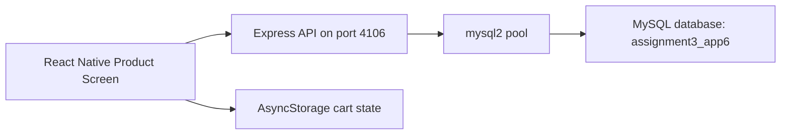
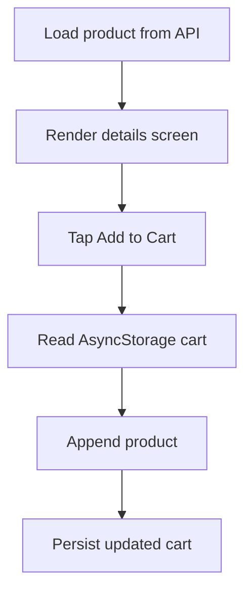

# E-Commerce Product Details App

## Overview

This project is a product details experience for a mobile shopping application. It loads a featured product from a MySQL-backed API and lets the user store that item locally with AsyncStorage using an "Add to Cart" flow.

The app demonstrates a practical blend of server-driven content and device-side persistence, which is a common pattern in real commerce apps.

## Architecture



## Key Features

- Fetches a product record from a dedicated backend endpoint
- Displays image, title, price, and description
- Saves selected product data locally using AsyncStorage
- Separates server persistence and client-side cart state cleanly
- Uses an isolated port and schema to remain fully independent

## Technology Stack

- React Native with Expo SDK 54
- AsyncStorage
- Express.js
- mysql2
- MySQL via XAMPP

## API Contract

### `GET /product`

Returns:

```json
{
  "id": 1,
  "title": "Noise Cancelling Earbuds",
  "image": "https://...",
  "price": "79.99",
  "description": "Lightweight earbuds..."
}
```

## Database Design

Database: `assignment3_app6`

Table: `products`

| Column | Type |
|---|---|
| id | INT, PK, AUTO_INCREMENT |
| title | VARCHAR(150) |
| image | VARCHAR(255) |
| price | DECIMAL(10,2) |
| description | TEXT |

## Data Flow



## Project Structure

```text
.
├── App.js
├── AppMain.js
├── server.js
├── sql2.sql
├── package.json
└── .gitignore
```

## Run Locally

1. Start MySQL in XAMPP.
2. Import [`sql2.sql`](./sql2.sql).
3. Run `npm install`
4. Run `node server.js`
5. Run `npx expo start -c`

Backend port: `4106`

## Engineering Notes

- The cart is intentionally stored locally to model a pre-checkout mobile experience.
- The project demonstrates both backend integration and client persistence in a compact, interview-friendly codebase.
